# DotaApi

# api
API atau Application Programming Interface adalah sebuah interface yang dapat menghubungkan aplikasi satu dengan aplikasi lainnya. Jadi, API berperan sebagai perantara antar berbagai aplikasi berbeda, baik dalam satu platform yang sama atau lintas platform.

# rest api
Prinsip kerja dari REST API ini adalah client akan menganggap server sebagai object yang dapat dibuat, diupdate, dihapus dan juga dibaca. Jadi pada pelaksanaannya akan ada create dengan request POST, update dengan request PUT atau PATCH, hapus dengan request DELETE, dan baca dengan request GET.

# perbedaan retrofit dan volley
- Retrofit : Retrofit ini merupakan Library turunan dari OkHTTP yang dibuat oleh Square yang digunakan sebagai REST Client pada Android, yang pasti akan memudahkan kita. Karena kita tidak perlu lagi untuk membuat Method sendiri untuk menggunakan REST Client API dari Backend. Library ini menyediakan framework yang powerfull untuk authenticating dan berinteraksi dengan API dengan mengirimkan request menggunakan OkHTTP. retrofit juga mendukung berbagai macam format authentikasi via http, menambahkan header pada request, menambahkan parameter serta mengirim data berupa image ke server.
- Volley : Volley adalah library HTTP yang mempermudah dan yang terpenting mempercepat networking untuk aplikasi Android. Tetapi Library buatan Google ini kurang populer dibanding kedua Library sebelumnya, karena fitur yang dimilikinya pun sedikit. Secara default, Volley menggunakan metode sinkronisas Jadi kalian tidak perlu membuat sebuah Method atau fungsi yang menggunake Class Asynctask. Dalam penggunaannya memang 'sedikit' sulit. Volley tidak cocok untuk operasi download atau streaming yang besar karena Volley menyimpan semua respons dalam memori selama mengambil data API.

# hasil
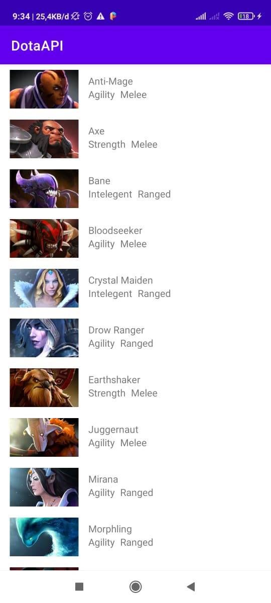
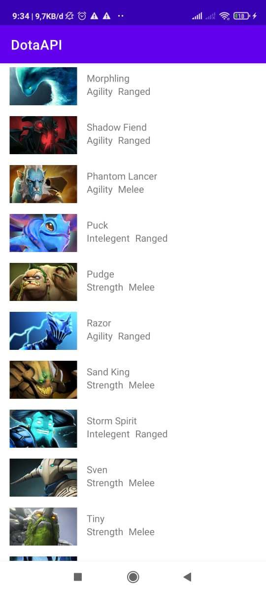
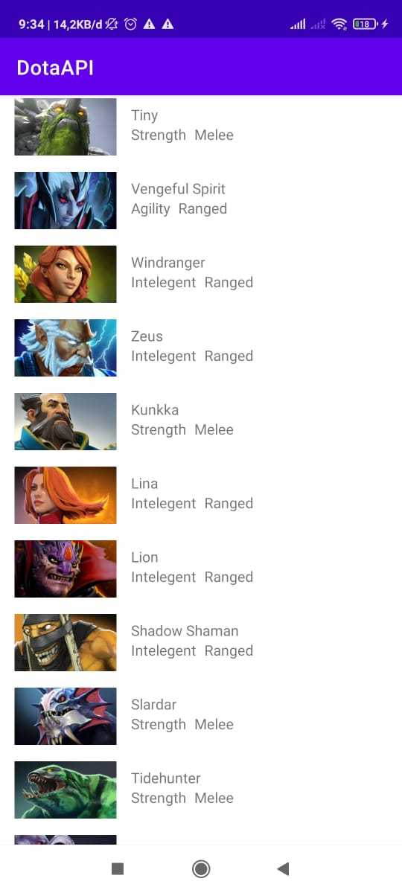
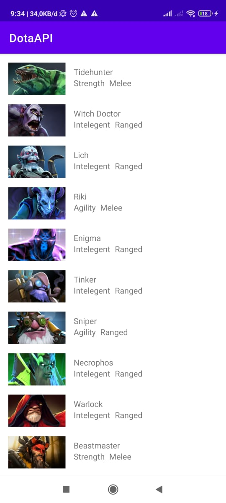
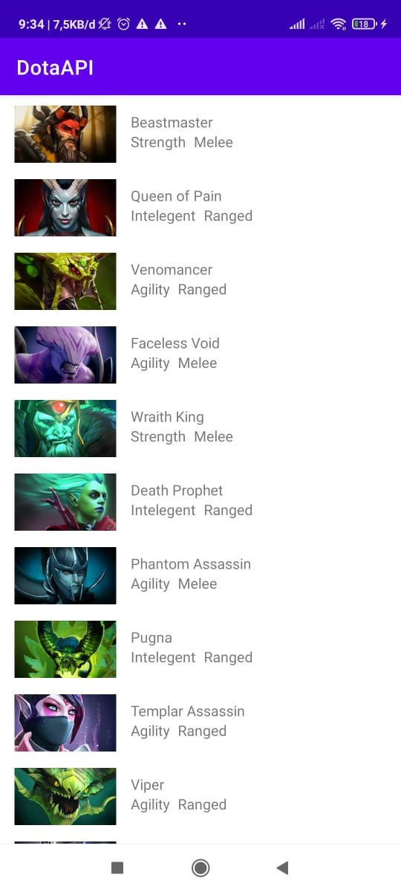
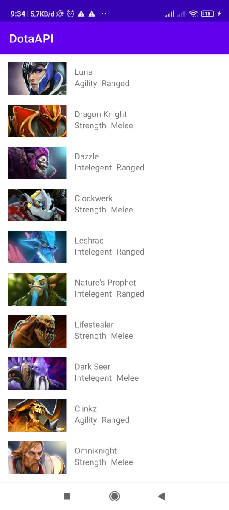
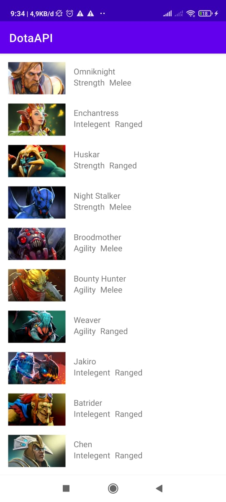
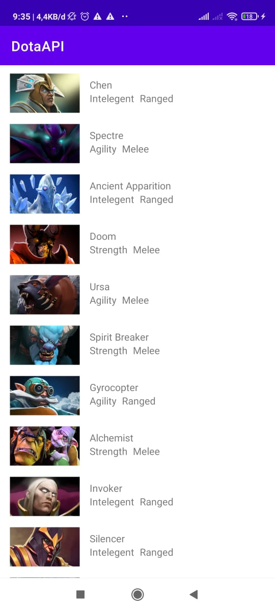
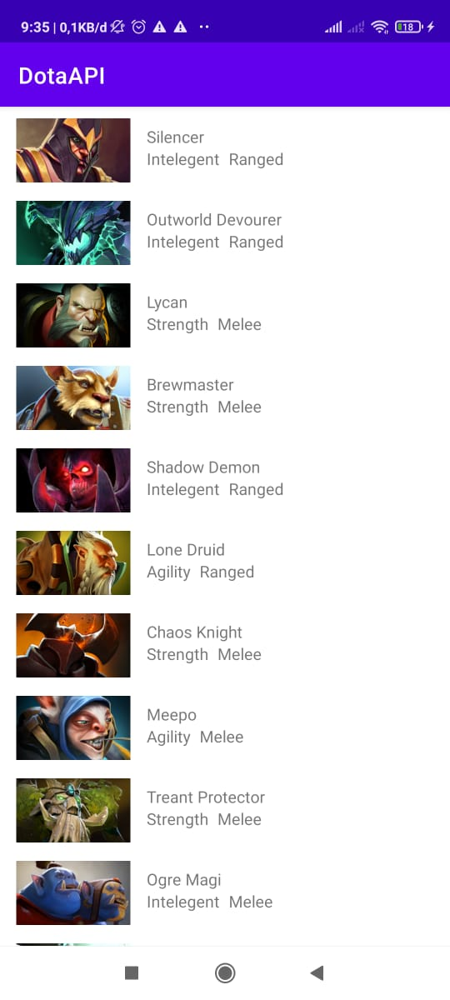
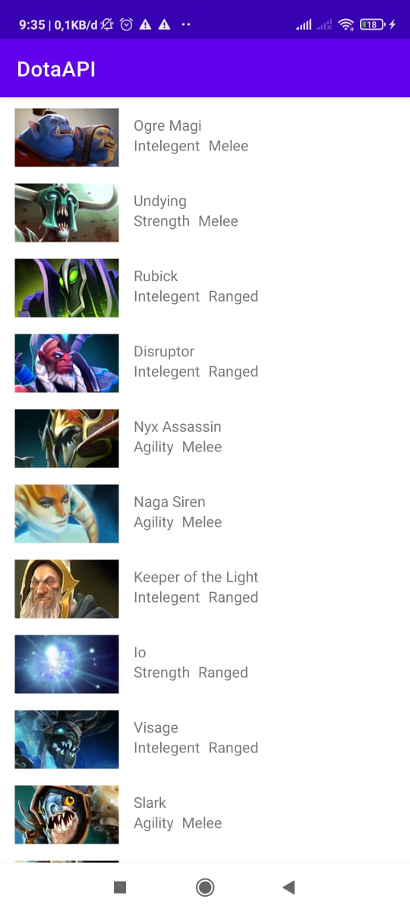
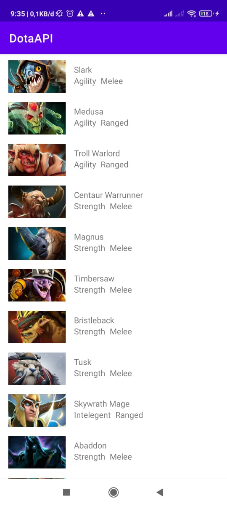
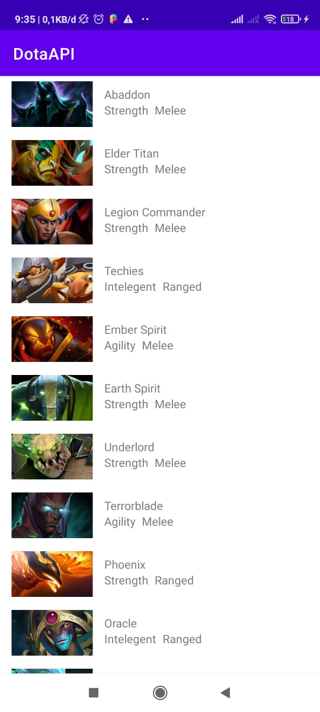
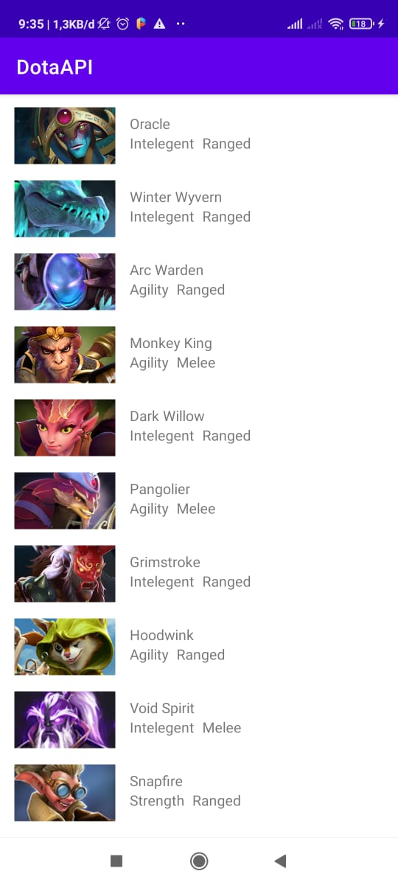
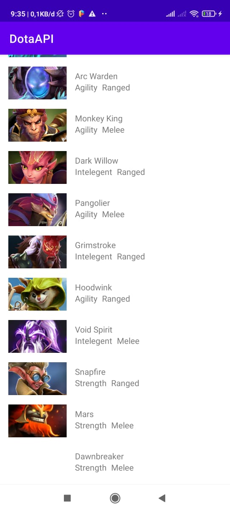

